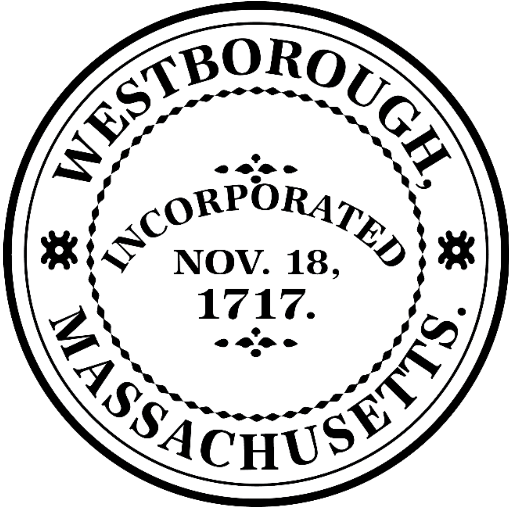

<!--
Copyright Nathan Walsh 2024
Initial conversion began February 26, 2024
Permission is given to the Town of Westborough to use this to generate printed or electronic
copies of the Rules and Regulations and to correct or add information to this repositiory as long as this
copyright message is kept.
All other rights are reserved.
-->
# Town of Westborough Massachusetts

{width=10% height=10%}

Board of Health

Town Hall

34 West Main Street

Westborough, MA 01581-1916

TEL (508) 366-3045

FAX (508) 366-3047

## Rules and Regulations for the Removal, Transport, and Disposal of Solid Waste or Recyclables in the Town of Westborough
I. Purpose
The goal of these regulations is to protect public health and the environment and ensure that all Private Haulers
collecting Solid Waste and Recyclables adhere to the Massachusetts Waste Ban regulations and uniformly comply
with permit requirements established by the Town of Westborough. This should ensure that:
* The environmental benefits of recycling are maximized.
* There is joint enforcement of the Waste Ban requirements by the municipality and all Private Haulers within the municipality.
* 
